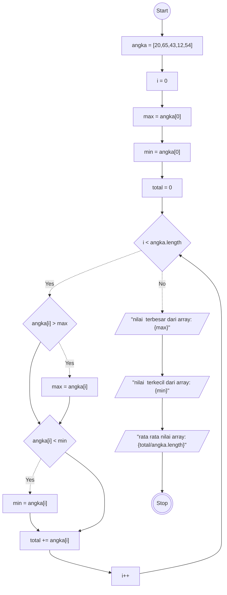

# Algoritma
## Algoritma Flowchart program hitung nilai dengan proses MIN, MAX, AVERAGE

Algoritma ini menjelaskan alur program hitung nilai dengan proses Max, Min, dan Average dengan Flowchart

```mermaid
flowchart TD
    A@{ shape: circle, label: "Start" }
    B@{ shape: rect, label: "angka = [20,65,43,12,54]" }
    C@{ shape: rect, label: "i = 0" }
    D@{ shape: rect, label: "max = angka[0]" }
    E@{ shape: rect, label: "min = angka[0]" }
    F@{ shape: rect, label: "total = 0" }

    G@{ shape: diamond, label: "i < angka.length" }
    H@{ shape: diamond, label: "angka[i] > max" }
    I@{ shape: rect, label: "max = angka[i]" }

    P@{ shape: diamond, label: "angka[i] < min" }
    Q@{ shape: rect, label: "min = angka[i]" }

    J@{ shape: rect, label: "total += angka[i]" }
    K@{ shape: rect, label: "i++" }

    L@{ shape: lean-r, label: '"nilai  terbesar dari array: {max}"' }
    M@{ shape: lean-r, label: '"nilai  terkecil dari array: {min}"' }
    N@{ shape: lean-r, label: '"rata rata nilai array: {total/angka.length}"' }

    O@{ shape: double-circle, label: "Stop" }

    A-->B-->C-->D-->E-->F-->G-.Yes.->H-->P
    P-.Yes.->Q-->J
    G-.No .->L-->M-->N-->O
    H-.Yes.->I-->P-->J-->K-->G


```
